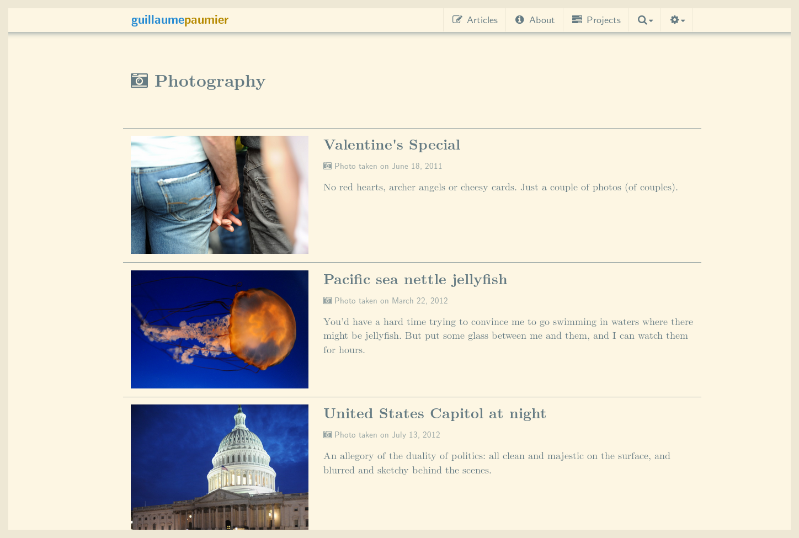

<section>
2014 in failures
----------------

Let's begin with what didn't work and get it out of the way. In January 2014, I started posting [some of my photos](http://guillaumepaumier.com/photo/) on this site. I have accumulated [dozens of thousands of photos](http://guillaumepaumier.com/2014/01/06/42812-photos/) over the past eight years, but published only a small fraction of them. By starting to publish a selection of them here, my goal was to create a momentum that would encourage me to process my backlog and publish my collections here and on Wikimedia Commons.

<figure><figcaption>The photos didn't last, but they might come back.</figcaption></figure>

The momentum didn't really last, though, and I ended up stopping after posting only seven photo articles. In retrospect, I think the issue wasn't really the photos themselves, but rather the accompanying texts. I've acknowledged this failure, and recently decided to retire the “Photo” section of this website. The photos are still online, but I've removed the navigation shortcut to that section.

I may resume posting photos in the future, although it's not a priority at the moment. If I do, I might change the format of the posts and only feature the photos with a very short text, if any.
</section>

<section>
2014 in work
------------

During most of 2014, I continued to work as Technical Communication Manager at the [Wikimedia Foundation](https://wikimediafoundation.org/), the nonprofit that operates Wikipedia.

Part of this work involved reviewing technical posts for the [Wikimedia blog](https://blog.wikimedia.org/); I notably edited and published a [series of](https://blog.wikimedia.org/2014/03/25/seeing-through-the-eyes-of-new-technical-contributors/)[candid essays](https://blog.wikimedia.org/2014/03/25/seeing-through-the-eyes-of-new-technical-contributors/) written by students who participated in the [Google Code-in](http://www.google-melange.com/gci/document/show/gci_program/google/gci2013/about_page) program. In their “discovery reports”, they outlined their first steps as members of the Wikimedia technical community, and provided a newcomer's perspective on tools and processes regularly used by experienced contributors.

I also continued to assemble [monthly engineering reports](http://www.mediawiki.org/wiki/Category:Wikimedia_engineering_reports), and to put together the [weekly technical newsletter](https://guillaumepaumier.com/project/wikimedia-tech-news/), which [celebrated its first anniversary](https://blog.wikimedia.org/2014/05/20/celebrating-one-year-of-tech-news/) in May. I also worked with [André](http://blogs.gnome.org/aklapper/) on the [Project management tools evaluation](https://www.mediawiki.org/wiki/Project_management_tools/Review), which eventually led the Wikimedia technical community to [migrate to Phabricator](https://blog.wikimedia.org/2014/06/10/on-our-way-to-phabricator/).

<figure><figcaption>In 2014, I continued to work on Technical Communications at the Wikimedia Foundation, before transitioning to a new position.</figcaption></figure>

I attended the [Zürich hackathon](https://blog.wikimedia.org/2014/05/10/tech-wizards-behind-wikipedia-meet-in-zurich-for-hackathon/), as well as [Wikimania](http://wikimania2014.wikimedia.org/), the annual Wikimedia conference, whose 2014 edition was in London. At Wikimania, I presented on Tech News and put together a poster so that attendees could learn about it even if they couldn't attend the presentation.

In September, my role at the Wikimedia Foundation [changed](https://lists.wikimedia.org/pipermail/wikimediaannounce-l/2014-October/000993.html), and I started working on other projects, most notably the [File metadata cleanup drive](http://guillaumepaumier.com/project/file-metadata-cleanup-drive/). The drive is an initiative to decrease the number of files (on Wikimedia sites) whose information can't be read by programs.

<figure><figcaption>In September, my role at the Wikimedia Foundation changed, and I started to work on other projects, like the [File metadata cleanup drive](http://guillaumepaumier.com/project/file-metadata-cleanup-drive/).</figcaption></figure>
</section>

<section>
2014 in self-discovery
----------------------

2013 had been a turning point for me, in that I had discovered that I was likely on the [high-functioning](https://en.wikipedia.org/wiki/Asperger_syndrome)[part of the](https://en.wikipedia.org/wiki/Asperger_syndrome)[autistic](https://en.wikipedia.org/wiki/Asperger_syndrome)[spectrum](https://en.wikipedia.org/wiki/Asperger_syndrome). In 2014, a few experts officially confirmed that hypothesis. When asked why this had not been detected earlier in my life, the prevailing hypothesis was that I had unwittingly compensated this social blindness by a higher intelligence, as suggested by tests performed in 2013. I like to think of it as having my my own emulated [emotion chip](https://en.wikipedia.org/wiki/Data_(Star_Trek)).

<figure><figcaption>I feel like I deserve a membership card or something.</figcaption></figure>

Throughout 2014, I continued to research and read on this topic. Doing so, I've continued to better understand my [blind spots](http://aspiesforpresident.tumblr.com/), and explored what I now refer to as my “super-powers”, a fancy way of characterizing [the unique way](http://arstechnica.com/science/2015/01/the-connections-in-autistic-brains-are-idiosyncratic-and-individualized/) in which my brain works.

Notably, I started reading on a variety of specialized topics I was not familiar with but intrigued me. Doing so, I discovered that I was very fast at picking up and understand new concepts and disciplines. I had had a feeling that that was the case for a long time, but experimenting with this skill was particularly fun and rewarding (I've recently been reading about Civil engineering and Human spaceflight).
</section>

<section>
2014 in transatlantic move
--------------------------

The biggest change in 2014 was [our emigration from France to the US](http://guillaumepaumier.com/2015/02/20/transatlantic-move-2/%20"Transatlantic%20move%20II:%20They"). As part of my role change at the Wikimedia Foundation, I relocated to the San Francisco Bay Area ([again](https://guillaumepaumier.com/2010/01/27/back-in-the-game/)). The relocation process was easier this second time around, in part because my partner was able to relocate with me this time, and also because we decided to get organized.

<figure><figcaption>That cold morning of October, we left France and embarked on [our journey to San Francisco](http://guillaumepaumier.com/2015/02/20/transatlantic-move-2/).</figcaption></figure>

Transitioning from a completely-remote environment to a tech open-space has required some adjustments, but overall we're very happy to have relocated.
</section>

<section>
2014 in physical activity
-------------------------

I do go outside sometimes, and as someone intrigued by the concept of [Quantified Self](https://en.wikipedia.org/wiki/Quantified_Self), I try to keep metrics about my life whenever possible. Physical activity is one of the easiest things to track thanks to dedicated mobile apps.

| Activity                  | Distance (km) | Distance (mi) |
| ------------------------- | -------------:| -------------:|
| Running                   | 178 km        | 110 miles     |
| Hiking (inc. snowshoeing) | 163 km        | 101 miles     |
| Downhill skiing           | 105 km        | 65 miles      |
| Cycling                   | 49 km         | 30 miles      |
| Cross-country skiing      | 21 km         | 13 miles      |

I love to hike and I occasionally run. In 2014, I knew we were going to relocate to sunny California, so I decided to take advantage of the snowy Alps while we were still in France.

<figure><figcaption>Some days, taking the chairlift isn't nearly as fun as snowshoeing to the summit.</figcaption></figure>

It had been years since I had skied downhill, but after a couple of days it all came back and I enjoyed it a lot. I also started snowshoeing, which was a really nice complementary activity. Where downhill skiing involves sprints and adrenalin, snowshoeing involves endurance and beautiful lesser-used forest trails.
</section>

<section>
The year ahead
--------------

2015 is already well underway, but it's not too late to mention what I'm planning to do this year.

Regarding my work at the Wikimedia Foundation, I'm continuing to lead the File metadata cleanup drive, and I'm hoping to continue to drive down the number of files missing machine-readable metadata. I also have a few smaller projects in the pipeline, notably the [Template taxonomy](http://meta.wikimedia.org/wiki/Templates/Taxonomy).

Regarding [personal work and recreation](https://twitter.com/gpaumier/status/422032557064986625), I've started to learn Spanish again. My goal is to be able to handle basic communication by Summer, when I may [visit Mexico City](https://wikimania2015.wikimedia.org/wiki/Main_Page). Hopefully, by then, I'll be able to say more than “¡Hola!”, “Soy una tortuga” and “El elefante come la manzana”.

I've also decided to learn to play the piano; we'll see how far I can go in one year. Considering that I'm a total beginner, I can only make progress!

<figure><figcaption>This year, I'm starting (from scratch) to learn to play the piano.</figcaption></figure>

Last, I intend to continue to populate this site with historical and new content. My current priority at the moment is finishing to [write about past projects](https://guillaumepaumier.com/projects/) before embarking on new ones, but I do think there will be room to post new content before next year's “year in review” post.
</section>
