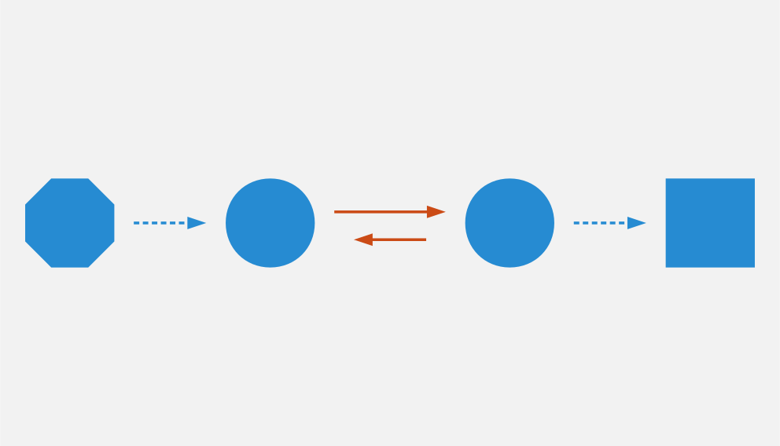
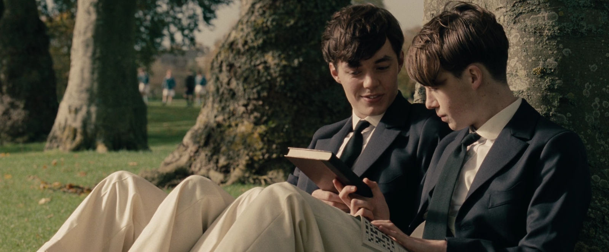
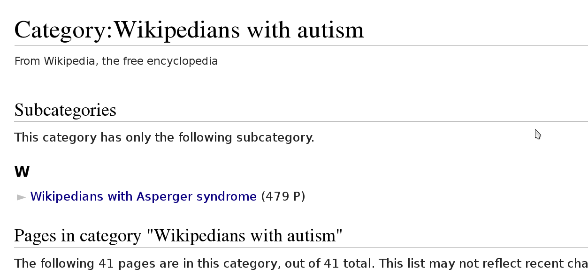

Il y a deux ans, j'ai découvert que j'appartenais au spectre autistique. Cela m'a permis de mieux comprendre comment je fonctionnais, et comment mon cerveau fonctionnait; j'ai ainsi pu analyser mes expériences passées d'un nouvel œil. Dans cet essai, je souhaite partager ce que j'ai appris au cours de ce processus, à travers mes succès, mes échecs, et de nombreuses situations que je n'ai pas comprises à l'époque, notamment au cours de mes interactions avec d'autres Wikipédiens.

*Cet essai est à l'origine de ma [présentation du même nom](https://wikimania2015.wikimedia.org/wiki/Submissions/My_life_as_an_autistic_Wikipedian) donnée lors de la conférence Wikimania 2015. Il s'agit d'un brouillon, que j'ai décidé de publier maintenant afin d'éviter une attente trop longue ; je vais continuer à le peaufiner au cours des prochaines semaines, et [vous pouvez contribuer](https://github.com/gpaumier/gp2/blob/master/src/articles/2015-07-21%20autistic-wikipedian/index_fr.md) à son amélioration. Le [texte original en anglais](http://guillaumepaumier.com/2015/07/29/autistic-wikipedian/) est également disponible.*

## Introduction

Ceci est une photo de moi prise quand j'avais 4 ans, à l'école maternelle.

Je n'ai pas beaucoup de souvenirs de cette époque, mais mes parents se rappellent notamment que, bien que je ne fus généralement pas très enthousiaste à l'idée d'aller à l'école durant la semaine, je demandais plus souvent à y aller le samedi matin, car la plupart des autres enfants n'étaient pas là.

Je n'avais rien contre eux personnellement ; l'école était simplement plus calme le samedi. Je n'avais pas à interagir avec les autres enfants, et je n'avais pas besoin de partager les crayons, les jouets, ou même la pièce. Je pouvais faire ce que je voulais sans avoir à me soucier des autres enfants.

Je ne le savais pas à l'époque, mais il me faudrait près de 30 ans pour regarder cette anecdote sous un nouveau jour, et comprendre en quoi elle était en fait complètement logique.

## Aujourd'hui

J'ai maintenant 32 ans, et beaucoup de choses ont changé. Il y a deux ans, après quelques difficultés au travail, mon compagnon a décidé de me dire qu'il soupçonnait depuis quelque temps que j'appartenais au spectre autistique. Je ne savais que très peu sur l'autisme à l'époque, mais c'était une hypothèse qui semblait expliquer beaucoup de choses, et méritait d'être explorée.

Bien sûr, le sujet avait été abordé plusieurs fois au fil des ans, notamment lors de mes études, mais toujours comme une plaisanterie, une exagération de mon comportement. Je n'avais jamais vraiment pensé que cette définition pouvait s'appliquer à moi.

L'un des problèmes est que l'autisme est généralement représenté de manière très uniforme dans la culture populaire. Les films comme *Rain Man* présentent des autistes savants qui, même s'ils ont des capacités extraordinaires, vivent dans un monde complètement différent, et parfois ne parlent pas du tout. Le spectre autistique est beaucoup plus large que ces exemples stéréotypés.

Au fur et à mesure de mes recherches sur le sujet, de mes lectures de livres sur l'autisme et d'autobiographies de personnes autistes, je me suis rendu compte d'à quel point mon expérience était proche de ce qui y était décrit.

Il a fallu un peu plus de temps (et quelques tests) pour obtenir une confirmation de la part d'experts. Même quand cette confirmation est arrivée, le doute était encore très présent auprès des membres de ma famille.

La question qui revenait le plus souvent était la suivante : « Pourquoi n'a-t-on pas détecté ça plus tôt ? » En effet, l'autisme est généralement remarqué à un âge beaucoup plus jeune, et apparemment j'avais réussi à me déguiser, pendant la plus grande partie de ma vie, en « neurotypique », c'est à dire quelqu'un dont le cerveau fonctionne de façon similaire à la plupart des gens.

L'hypothèse qui prévaut actuellement pour expliquer ce déguisement est basée sur un test de QI réalisé lors du processus d'évaluation. Ce test a suggéré que j'avais des capacités intellectuelles supérieures à la moyenne, qui me permettent apparemment de compenser en partie la différence de structure de mon cerveau.

Pour mieux comprendre cette explication, j'aime utiliser une analogie informatique : c'est comme si mon processeur tournait à une fréquence plus élevée que la moyenne, ce qui me permet d'émuler avec un logiciel ce que le hardware ne sait pas faire. Cette analogie illustre également ceci : combien faire tourner ce programme en permanence peut être fatigant, et pourquoi j'ai parfois besoin de me reposer en m'isolant.

Comme vous pouvez l'imaginer, se rendre compte à 31 ans que l'on est sur le spectre autistique change complètement sa perception du monde : tout paraît soudain beaucoup plus logique. J'ai beaucoup appris sur moi-même au cours des deux dernières années, et cette métacognition accrue m'a permis de regarder les évènements passés d'un œil nouveau.

Dans cet essai, je veux partager quelques unes des choses que j'ai apprises, et ma compréhension actuelle de la façon dont mon cerveau fonctionne. J'utiliserai notamment mes expériences de Wikimédien comme illustration.

Je veux commencer avec une mise en garde : l'autisme est un spectre. Il y a un dicton populaire parmi les communautés d'autistes sur internet : « Vous avez rencontré un autiste, vous avez rencontré *un* autiste. » Ce que je décris ici est basé sur mon expérience personnelle, et n'est pas applicable de façon universelle à toutes les personnes autistes.

", par [Cary Bass](https://commons.wikimedia.org/wiki/User:Bastique), sous licence [CC-By-SA 3.0 Unported](https://creativecommons.org/licenses/by-sa/3.0/legalcode), depuis Wikimedia Commons.](Taipei_Wm2007_Guillaume.jpg)

La photo ci-dessus a été prise lors de la conférence Wikimania 2007 à Taipei, alors que j'explorais la ville avec Cary Bass (User:Bastique) et d'autres Wikimédiens. En regardant cette photo aujourd'hui, je remarque plusieurs choses qui m'avaient échappé auparavant :

* Dans cette photo, je porte des vêtements simples, aux couleurs plutôt neutres, parce que je n'ai absolument aucun sens de la mode.
* Je porte deux sacs (un sac à dos et un sac photo), parce que j'emmène toujours avec moi tout un tas de choses pour être prêt pour quasiment n'importe quelle situation.
* Je me suis assis pour changer d'objectif sur mon appareil photo. La position assise est plus stable, et réduit ainsi le risque de chute (et de casse) de mon matériel photo coûteux. J'ai appris plus tard que cette habitude d'utiliser des positions très stables était en fait une stratégie d'atténuation que j'ai développée au fil des années sans le savoir, pour compenser des problèmes d'équilibre et de coordination motrice.

## Spock

", by NBC Television, dans le domaine public, depuis Wikimedia Commons.](Leonard_Nimoy_William_Shatner_Star_Trek_1968.jpg)

"[Leonard Nimoy William Shatner Star Trek 1968](https://commons.wikimedia.org/wiki/File:Leonard_Nimoy_William_Shatner_Star_Trek_1968.JPG)", by NBC Television, dans le domaine public, depuis Wikimedia Commons.

Une bonne analogie pour aider à comprendre ce que ça fait d'être autiste dans une société neurotypique est de regarder M. Spock, dans la série originale *Star Trek*. Fils d'un père Vulcain et d'une mère humaine, Spock est techniquement à moitié humain, mais c'est son côté Vulcain qui est le plus visible lors de ses interactions avec l'équipage de l'*Enterprise*.

Certains des moments les plus drôles de la série sont ses discussions animées avec l'irascible docteur McCoy, qui qualifie Spock d' « automate insensible » et d'« homme le plus dépourvu de sentiments qu'[il ait] jamais rencontré ». Ce à quoi Spock répond: « Oh, je vous remercie, docteur. » [^sttos120]

[^sttos120]: https://en.wikipedia.org/wiki/Court_Martial_%28Star_Trek:_The_Original_Series%29

En tant que Vulcain, Spock ne vit que par la logique. Bien qu'il ressente des émotions, elles sont profondément refoulées. Sa façon de parler est très détachée, presque clinique. Les collègues de Spock le trouvent souvent dédaigneux, dépourvu d'émotions, ou tout simplement malpoli, du fait de son point de vue logique et utilitariste.

À bien des égards, les traits de Spock sont similaires à ceux de l'autisme, et de nombreuses personnes autistes s'identifient à lui. Par exemple, dans son livre *Thinking in Pictures*, Temple Grandin, une scientifique et auteure autiste de renom, raconte comment elle se sentait proche de Spock:

> Beaucoup de gens autistes sont fans de la série télévisée *Star Trek*. [...] Je me suis fortement identifiée avec le logique M. Spock, car son mode de pensée me semblait très proche du mien.
>
> Je me souviens très bien d'un vieil épisode car il dépeignait un conflit entre la logique et l'émotion d'une manière que je pouvais comprendre. Un monstre tentait de fracasser la navette d'exploration avec des rochers. Un membre d'équipage avait été tué. Le logique M. Spock voulait décoller et s'échapper avant que le monstre ne détruise la navette. Les autres membres de l'équipage refusaient de quitter la surface avant d'avoir récupéré le corps du membre d'équipage mort. [...]
>
> J'étais d'accord avec Spock, mais j'ai appris que les émotions dominent souvent la logique, même si ces décisions sont dangereuses. [^grandin]

[^grandin]: Temple Grandin. *Penser en images*. p.152

Dans cet exemple, et dans de nombreux autres, le filtre de perception de Spock l'empêche de comprendre les décisions humaines motivées principalement par l'émotion. Ces actions semblent stupides ou absurdes, parce que Spock les interprète à travers son œil logique. Il lui manque le contexte culturel, les normes sociales et les hypothèses tacites inconsciemment partagés par les humains.

L'inverse est également vrai : Chaque fois que les humains sont perplexes ou ennuyés par Spock, c'est parce qu'ils attendent de lui qu'il se comporte comme un humain ; ils sont souvent confrontés à une vérité plus dure qu'ils ne le souhaiteraient. Les humains interprètent le comportement de Spock à travers leur propre filtre de perception, le filtre émotionnel. Ils comprennent souvent mal ses motivations, présument la mauvaise foi, et projettent des intentions qui changent le sens des paroles et des actions du Vulcain.

## Autisme

Vous avez probablement entendu parler des [modèles conceptuels de communication](https://en.wikipedia.org/wiki/Models_of_communication). Dans de nombreux modèles, la communication est représentée comme la transmission d'un message entre un émetteur et un récepteur.

Si l'on applique ce modèle à une conversation orale, on voit rapidement toutes les possibilités de mauvaise communication : entre ce que l'émetteur pense, ce qu'il communique, ce que le récepteur entend, et ce qu'il comprend, l'information peut changer drastiquement, surtout quand on prend en compte la communication non verbale. C'est comme si les deux personnes jouaient au téléphone arabe. Le psychologue Tony Attwood l'explique ainsi :

> Chaque jour, les gens font des suppositions de manière intuitive concernant ce que quelqu'un peut penser ou ressentir. La plupart du temps, on tombe juste, mais le système n'est pas sans faille. Nous ne lisons pas dans les pensées de façon parfaite. Les interactions sociales seraient tellement plus facile si les gens typiques disaient exactement ce qu'ils pensent, sans suppositions ou ambiguïté. [^attwood126]

[^attwood126]: Tony Attwood. *Le guide complet pour le syndrome d'Asperger*. p.126

Si cela est le cas pour les personnes neurotypiques (les gens avec un cerveau « typique »), imaginez combien cela peut être difficile pour les autistes comme moi. Une très bonne analogie est donnée dans le film *Imitation Game*, inspiré de la vie d'Alan Turing, qui est présenté dans le film comme appartenant au spectre autistique.

Si l'on met de côté les critiques liées à la liberté artistique et la dramatisation, l'un de mes moments préférés dans le film est quand le jeune Alan discute avec son ami Christopher de messages codés. Christopher explique la cryptographie comme des « messages que tout le monde peut voir, mais dont personne ne sait ce qu'ils signifient, sauf si l'on a la clé. »

Alan répond, très perplexe :

> En quoi est-ce différent d'une discussion ? [...] Quand les gens parlent entre eux, ils ne disent jamais ce qu'ils pensent, ils disent autre chose. Et on est censé comprendre exactement ce qu'ils veulent dire. Seulement, moi, je ne comprends jamais.

Les personnes autistes sont caractérisées par de nombreuses spécificités, mais l'une des plus répandues est la cécité sociale : nous avons du mal à lire les émotions des autres. Nous manquons de « [Théorie de l'esprit](https://fr.wikipedia.org/wiki/Theorie_de_l'esprit) », qui sert aux personnes neurotypiques à déterminer les états mentaux (comme les croyances et les intentions) des autres. Nous prenons souvent les choses au premier degré, parce que les sous-entendus nous échappent: il est difficile pour nous de lire entre les lignes.

Liane Holliday Willey, autiste, auteure et conférencière, l'explique ainsi :

> Personne n'aurait besoin d'une théorie de l'esprit si les gens disaient simplement ce qu'ils pensent. [^willey]

[^willey]: Liane Holliday Willey, dans *Le guide complet pour le syndrome d'Asperger*. Tony Attwood, p.126

## Comment ça va ?

Dans beaucoup de langues, il existe une expression usuelle pour demander à quelqu'un comment il va, que ce soit « Comment ça va ? » en français, « *How are you?* » en anglais, ou « *Wie geht's?* » en allemand.

Quand je suis arrivé aux États-Unis, chaque fois que quelqu'un me demandais en anglais: « *How are you?* » (« Comment ça va ? »), je devais faire une pause de quelques secondes pour réfléchir à la réponse. Depuis, j'ai appris que c'est une expression phatique, une question rhétorique. Si l'on me pose cette question, je donne désormais la réponse attendue : « *Great, how are you?* » (« Très bien, et toi, comment ça va ? »). Mon cerveau n'a besoin que de quelques millisecondes pour court-circuiter le processus de question-réponse. Mais si les gens dévient de cette salutation habituelle, ce raccourci mental ne fonctionne plus.

Il y a quelques semaines, quelqu'un de mon bureau m'a demandé: « *How is your world?* » (« Quoi de neuf dans ton univers ? »), et j'ai bloqué pendant quelques secondes. Afin de répondre à cette question, mon cerveau était en train de passer en revue tout ce qui se passait dans « mon univers » (et « mon univers » est immense !) ; après quelques secondes, je me suis rendu compte que j'avais seulement besoin de répondre « *Great, thank you!* » (« Super, merci ! »).

" par Randall Munroe, sous licence [CC-BY-NC 2.5](https://creativecommons.org/licenses/by-nc/2.5/legalcode), depuis xkcd.com.](small_talk.png)

## Privilège et oreilles pointues

Ce problème de premier degré n'est qu'un exemple des nombreux défis rencontrés par les personnes autistes, et je voudrais maintenant parler de privilège neurotypique. Je suis un homme caucasien, cisgenre, et j'ai grandi dans une famille aimante de la classe moyenne d'un pays industrialisé. Par bien des égards, je suis très privilégié. Mais, en dépit de mes superpouvoirs, il n'en reste pas moins difficile d'être autiste dans une société essentiellement neurotypique.

La conséquence la plus commune que j'ai remarquée dans mon expérience, et dans les retours d'autres personnes autistes, est un sentiment d'isolement profond. Le manque de théorie de l'esprit et le risque constant de mauvaise communication font qu'il est difficile de construire des relations avec les gens. Ce n'est pas la faute de qui que ce soit en particulier ; c'est un problème plus général de manque de sensibilisation.

", par <a href="https://commons.wikimedia.org/wiki/User:Chris_McKenna_(WMUK)">Chris McKenna</a>, sous licence <a href="https://creativecommons.org/licenses/by-sa/4.0/legalcode">CC-BY-SA 4.0 International</a>, depuis Wikimedia Commons.](Wikimania_2014_welcome_reception_02.jpg)

Imaginez que nous sommes en train de nous parler en face à face. Vous ne me connaissez pas vraiment, mais j'ai l'air sympathique, donc vous commencez à parler de choses et d'autres. Je ne dis pas grand chose, et vous avez besoin de faire avancer la discussion, notamment lors des silences inconfortables. Quand je me mets à parler, c'est d'une façon très monotone, comme si je n'y accordais pas vraiment d'importance. Vous faites plus d'efforts, par exemple en me posant des questions, mais j'hésite, j'ai du mal à maintenir le contact visuel, et je détourne mon regard sans cesse, comme si j'essayais d'inventer une réponse de toutes pièces.

Maintenant, voici ce qui est en train de se passer de mon point de vue : je suis en train de parler avec quelqu'un que je ne connais pas très bien, mais vous avez l'air sympathique. Je ne sais pas de quoi parler, alors je ne dis pas grand chose. Les petits silences ne me gênent pas : je suis content d'être en votre compagnie. Ce dont nous parlons ne m'émeut pas outre mesure, donc je parle très calmement. Vous me posez des questions, et il me faut bien entendu un certain temps pour réfléchir à la bonne réponse. Le « contact visuel » qu'on m'a enseigné à l'école me prend beaucoup de ressources mentales qui seraient bien mieux utilisées à penser à la réponse à votre question, donc de temps en temps je détourne mon regard pour mieux me concentrer.

Cet exemple illustre l'une des nombreuses situations dans lesquelles le filtre de perception de chaque personne crée une déconnexion complète entre les façons dont la situation est perçue de chaque côté.

Il y a aussi de nombreux obstacles professionnels associés au fait d'être sur le spectre autistique, et les personnes autistes sont plus touchées par le chômage que les neurotypiques [^npr-unemployment]. J'ai la chance d'avoir pu trouver un environnement dans lequel je suis en mesure de travailler, mais de nombreux autistes ne sont pas aussi chanceux. Il est établi que les personnes occupant des postes élevés ne sont pas nécessairement les employés les plus performants, mais bien souvent ceux ayant les meilleures compétences sociales.

En gardant ça en tête, imaginez quelles sont les opportunités de carrière possibles pour quelqu'un qui ne sait pas mentir, quelqu'un pour qui faire de l'excellent travail compte beaucoup, mais qui ne s'inquiète pas de s'en attribuer le mérite, quelqu'un qui ne comprend pas les intrigues de bureau, qui non seulement fait des faux-pas sociaux et fâche ses collègues, mais en plus ne s'en rend même pas compte, quelqu'un qui est incapable de parler de la pluie et du beau temps. Imaginez cette personne, et quel genre de carrière elle peut avoir, même si elle est très bonne dans son travail.

[^npr-unemployment]: http://www.npr.org/blogs/health/2015/04/21/401243060/young-adults-with-autism-more-likely-to-be-unemployed-isolated

Les discussions occasionnelles avec les collègues et les connaissances sont généralement superficielles ; les enjeux des discussions autour de la machine à café sont faibles, ce qui fait que les gens sont plus enclins à pardonner les faux-pas. Par contre, les relations amicales sont une autre paire de manches, et pour la plus grande partie de ma vie, je  n'ai pas vraiment eu d'amis (sauf si l'on utilise la définition de Facebook). La maladresse sociale est généralement tolérée, mais rarement recherchée. Elle n'est pas « cool ».

La plupart de ces problèmes surviennent parce qu'il est difficile pour les neurotypiques de savoir que la personne à qui ils sont en train de parler est différente. Spock lui, avait ses oreilles pointues pour signaler qu'il n'était pas humain. Si l'équipage de l'*Enterprise* l'a accepté en son sein, c'est en grande partie grâce aux relations qu'il a pu nouer avec ses compagnons de bord. Ces relations auraient sans doute été plus difficiles à établir si l'équipage n'avait pas su en quoi Spock était différent.

## La communication par ordinateur

Je voudrais revenir à ce modèle conceptuel de la communication. Imaginez comment ce modèle change si, au lieu de discuter en face à face, il s'agit d'une discussion par internet : par e-mail, sur un wiki, ou sur IRC. Tous ces moyens de communication, bien connus des Wikimédiens, font appel à l'écriture, et sont généralement asynchrones. Pour de nombreux neurotypiques, ces moyens de communication sont frustrants, car ils font disparaitre la plupart des signaux non verbaux habituels comme le ton, les expressions faciales et le langage corporel.

Toutefois, ce modèle de communication par ordinateur est beaucoup plus proche du modèle de communication des autistes comme moi. Il n'y a aucune communication non verbale à décrypter ; il y a moins d'interaction et d'anxiété sociale ; et généralement, l'environnement est connu. Il y a beaucoup moins de signaux à traiter, et ceux qui subsistent ne sont que des mots : certes, leur signification varie, mais elle est beaucoup plus codifiée et plus fiable que les signaux non verbaux.

Les communications par internet asynchrones donnent également plus de temps de réflexion pour élaborer une réponse avec attention. Contrairement aux discussions de vive voix, qui sont immédiates et irréversibles, un texte peut être méticuleusement modifié, reformulé, ou réécrit jusqu'à ce qu'il dise exactement ce que l'on veut dire ; alors seulement, on peut décider de l'envoyer. Ceci est vrai des moyens asynchrones comme l'e-mail et les wikis, mais également dans une certaine mesure des moyens semi-synchrones comme la messagerie instantanée ou IRC.

Cela dit, tout n'est pas rose quand on communique par internet. Par exemple, même en ligne, il reste très difficile pour les personnes autistes de lire entre les lignes. Nous avons tendance à être très honnêtes, ce qui n'est pas forcément apprécié, que ce soit sur internet ou ailleurs. Les personnes autistes sont également plus susceptibles d'être victimes de [trollage](https://fr.wikipedia.org/wiki/Troll_%28Internet%29), et ne se rendent pas toujours compte que la façon dont les gens se comportent sur internet n'est pas obligatoirement la même que dans le monde physique. La communication par l'internet tend à désensibiliser les utilisateurs ; les personnes autistes qui ont tendance à émuler les comportements neurotypiques pour s'intégrer risquent ainsi de reproduire des comportements qui ne sont pas acceptables, quel que soit le lieu.

## Autisme dans la communauté Wikimedia

Un exemple majeur de communication en ligne à grande échelle est le mouvement Wikimedia. À première vue, les sites Wikimedia, et Wikipédia en particulier, offrent une plate-forme de choix pour qui souhaite soigneusement compiler des faits sur son obsession favorite, ou corriger méthodiquement la même erreur grammaticale encore et encore, tout en limitant les interactions sociales. Wikipedia semble être un appeau à autistes parfait.

Par exemple, ma première modification, il y a dix ans, a été de corriger une faute d'orthographe. La deuxième, une faute de conjugaison. La troisième, une faute d'orthographe *et* une faute de conjugaison. C'est comme ça que mon voyage de Wikipédien a commencé.

Les Wikipédiens vénèrent les citations, les références et la vérifiabilité ; les faits sont rois, et l'interprétation est taboue. Du moins tant que l'on reste dans l'espace principal. Dès que l'on quitte les articles encyclopédiques et que l'on s'aventure dans les pages de discussion et autres « bistros » Wikipédiens, ces exigences ne s'appliquent plus. Les discussions entre Wikipédiens regorgent d'opinions, d'exagérations, et de déclarations non sourcées.

À tout ceci s'ajoutent les difficultés mentionnées plus tôt. En tant qu'autiste, il peut être difficile de lâcher prise au cours des débats et des disputes sur des sujets qui nous tiennent à cœur. On dit souvent que les personnes autistes manquent d'empathie, ce qui donne l'impression que nous sommes des robots dépourvus d'émotions. Cependant, il faut faire la différence entre la capacité à *lire les sentiments* de la personne en face de nous, et le fait d'*éprouver de la compassion* pour cette personne. Les personnes neurotypiques possèdent des neurones miroirs, qui leur font ressentir ce que la personne en face d'elles ressent ; les personnes autistes en possèdent beaucoup moins, ce qui signifie qu'elles ont besoin de scruter les signaux et d'essayer de comprendre ce que l'interlocuteur ressent. Elles n'en restent pas moins des personnes avec des émotions.

Pour en savoir plus sur l'autisme au sein de la communauté Wikimedia, je vous invite à lire un [excellent essai](https://en.wikipedia.org/wiki/Wikipedia:High-functioning_autism_and_Asperger%27s_editors) sur Wikipedia en anglais. J'apprécie notamment beaucoup le fait que ce texte évite la pathologisation de l'autisme, et insiste plutôt sur le concept de neurodiversité, c'est à dire présenter l'autisme comme une différence, pas une maladie.

## Conclusion

Steve Silberman, qui a écrit un livre sur l'histoire de l'autisme, explique le concept de neurodiversité de la façon suivante :

> Une façon de comprendre la neurodiversité est de penser en termes de systèmes d'exploitation humains : Le fait qu'un PC n'utilise pas Windows ne veut pas dire qu'il est cassé.
>
> D'un point de vue autiste, le cerveau humain normal est facilement distrait, social à l'obsession, et souffre d'un manque d'attention au détail. [^silberman-ted]

[^silberman-ted]: http://www.ted.com/talks/steve_silberman_the_forgotten_history_of_autism

Malgré tout, être autiste a un coût, et parfois, lors de nos interactions, vous vous sentirez vexé. Parfois, vous vous sentirez frustrés. Et parfois, vous vous direz « Waouh, je n'aurais jamais pensé à faire ça comme ça ».

Comme je l'ai mentionné plus tôt, je pense que Spock n'a été en mesure de construire une relation avec ses collègues au fil du temps que parce qu'ils étaient au courant de sa différence, et qu'ils ont appris à la comprendre et à l'adopter. Spock a également beaucoup appris des humains en cours de route.

Mon but ici était de faire prendre conscience de cette différence qui existe au sein de notre communauté, et de nous encourager à discuter de nos différences plus ouvertement, afin d'améliorer notre compréhension mutuelle.

Dans cet essai, j'ai laissé de côté de nombreux points que je développerai peut-être plus tard. En attendant, n'hésitez pas à continuer cette discussion, que ce soit en venant me parler en personne ou sur internet.

Longue vie et prospérité. \\///

", by [NASA](https://www.nasa.gov), in the Public domain, from Wikimedia Commons.](ISS-42_Samantha_Cristoforetti_Leonard_Nimoy_tribute.jpg)
